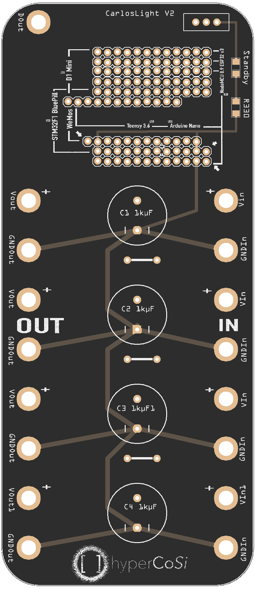

<br>

# Hypercosi

_Hyperion Configuration Tool and Simulator_


<br>

[](https://github.com/prettier/prettier)   
[![Build Status][travis-image]][travis-url] 
[![Appveyor Build Status][appveyor-image]][appveyor-url]  
[![Github Tag][github-tag-image]][github-tag-url]  
[![David Tag][david-image]][david-url] 
[![David Dev Tag][david-dev-image]][david-dev-url]  
[![Good First Issue Tag][good-first-issue-image]][good-first-issue-url]  

## Install

Clone the repo and install the dependencies:

```bash
git clone https://github.com/mommel/Hypercosi.git && \
cd Hypercosi && \
yarn
```

## Starting Development

Start the app in the `dev` environment. This starts the renderer process in [**hot-module-replacement**](https://webpack.js.org/guides/hmr-react/) mode and starts a webpack dev server that sends hot updates to the renderer process:

```bash
$ yarn dev
```

## Packaging for Production

To package apps for the local platform:

```bash
$ yarn package
```

## Maintainers

- [Mommel](https://github.com/mommel)
- [J. Weber](https://github.com/juliamweber)
- [Krachkind](https://github.com/krachkind)

## License

### Copyrights from 3rdparty Tools or assets




#### All files in src/images/textures/

- downloaded from [Subtle Patterns © Toptal Designers](https://toptal.com/designers/subtlepatterns]
- Copyright [CC BY-SA 3.0](https://creativecommons.org/licenses/by-sa/3.0/)

#### All files in node_modules have theor own licenses

[github-tag-image]: https://img.shields.io/github/tag/mommel/hypercosi.svg?label=version
[github-tag-url]: https://github.com/mommel/hypercosi/releases/latest
[travis-image]: https://travis-ci.com/mommel/hypercosi.svg?branch=master
[travis-url]: https://travis-ci.com/mommel/hypercosi
[appveyor-image]: https://ci.appveyor.com/api/projects/status/mmq9qb6cnrggmp8q/branch/master?svg=true
[appveyor-url]: https://ci.appveyor.com/project/mommel/hypercosi/branch/master
[david-image]: https://img.shields.io/david/mommel/hypercosi.svg
[david-url]: https://david-dm.org/mommel/hypercosi
[david-dev-image]: https://img.shields.io/david/dev/mommel/hypercosi.svg?label=devDependencies
[david-dev-url]: https://david-dm.org/mommel/hypercosi?type=dev
[good-first-issue-image]: https://img.shields.io/github/issues/mommel/hypercosi/good%20first%20issue.svg?label=good%20first%20issues
[good-first-issue-url]: https://github.com/mommel/hypercosi/issues?q=is%3Aopen+is%3Aissue+label%3A"good+first+issue"
