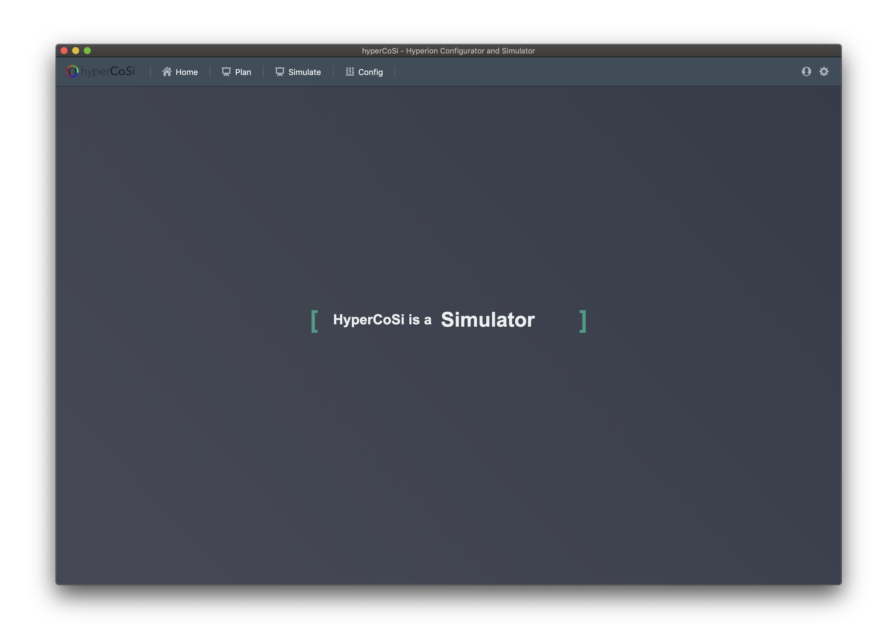
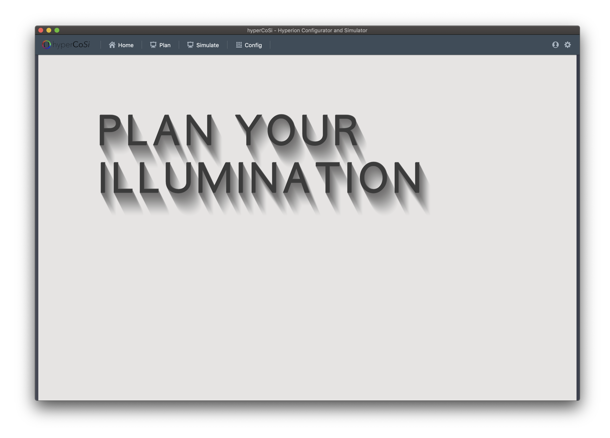
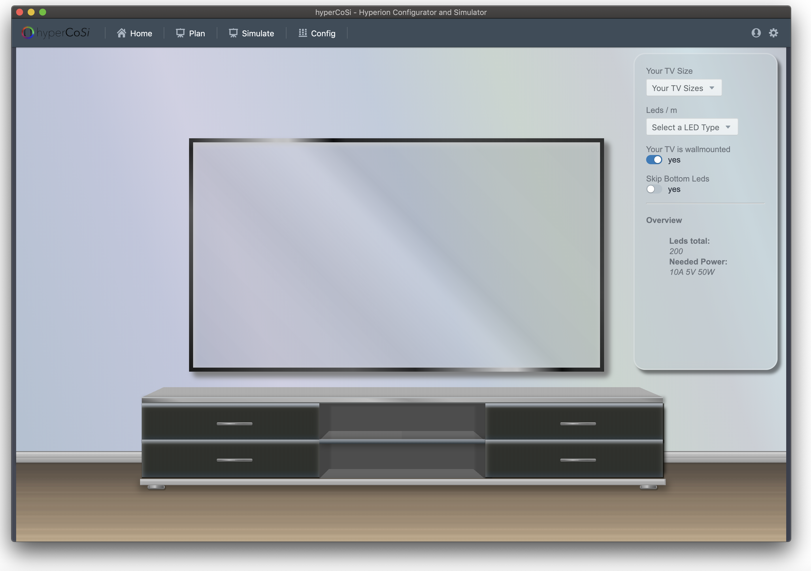
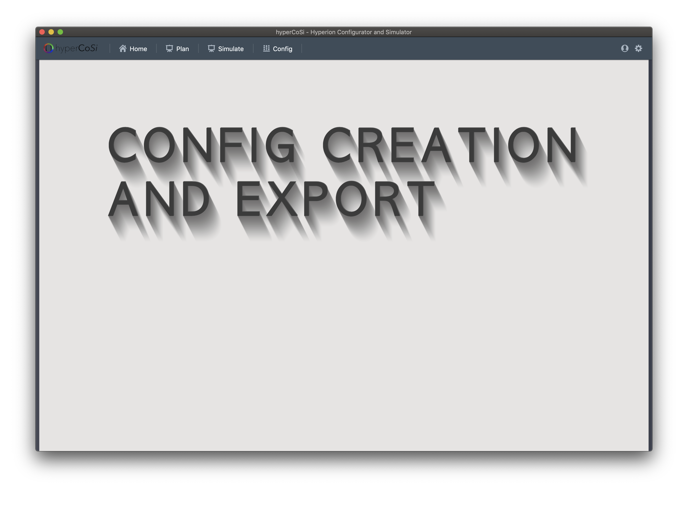

<br>

_Hyperion Configuration Tool and Simulator_

<br>

[](https://github.com/prettier/prettier)   
[![Build Status][travis-image]][travis-url] 
[![Appveyor Build Status][appveyor-image]][appveyor-url]  
[![Github Tag][github-tag-image]][github-tag-url]  
[![David Tag][david-image]][david-url] 
[![David Dev Tag][david-dev-image]][david-dev-url]  
[![Good First Issue Tag][good-first-issue-image]][good-first-issue-url]  

# Installation

## Get the code
Clone the repo and install the dependencies:
```bash
git clone https://github.com/mommel/Hypercosi.git && \
cd Hypercosi && \
yarn
```

## Development

### Start
Start the app in the `dev` environment. This starts the renderer process in [**hot-module-replacement**](https://webpack.js.org/guides/hmr-react/) mode and starts a webpack dev server that sends hot updates to the renderer process:

```bash
$ yarn dev
```

## Pack for Production

To package apps for the local platform:

```bash
$ yarn package
```

## run Tests

```bash
$ yarn test-all
```

## Completly stuck?

```bash
$ yarn wtf
```

# Storybook

```bash
$ yarn storybook
```


## Overview of usable yarn tasks

```bash
$ yarn tasks
```

# What is HyperCoSi for

## Screens

### Home
_This is the welcome page_


### Plan
_This is the planning page, where your inspirations flow_


### Simulate
_This is the simulation page, where your dreams come true_
 

### Export Config
_This is the export configuration page, where you go down the Rabbit-Hole.



# PCB
_You might want to build your hardware clean, so you can take 
This own invented PCB Design fits perfectly to our software.


## Questions
#### Wiki
Our [Wiki](https://github.com/mommel/Hypercosi/wiki) can be found [here](https://github.com/mommel/Hypercosi/wiki)

#### FAQ

# Maintainers

- [Mommel](https://github.com/mommel)
- [J. Weber](https://github.com/juliamweber)
- [Krachkind](https://github.com/krachkind)


# Found an Security Issue?
Check the [security.md](https://github.com/mommel/Hypercosi/blob/master/.github/SECURITY.md)

# License

## HyperCoSi
is Copyrighted by the Maintainers listed in this README licensed below [CC BY-NC-SA 4.0](https://creativecommons.org/licenses/by-nc-sa/4.0/)  

## HyperCoSi-PCB
is Copyright by Mommel and licensed below
[CC BY-NC-SA 4.0](https://creativecommons.org/licenses/by-nc-sa/4.0/)

## Dependencies
All files in node_modules have their own licenses

    * [Electron](https://electronjs.org/) - [MIT](https://github.com/electron/electron/blob/master/LICENSE)
    * React
    * Redux
    * [Webpack](https://webpack.js.org) - [MIT](https://webpack.js.org/license/) 
    * ...

Thanks to [electron-react-boilerplate](https://github.com/chentsulin/electron-react-boilerplate) for good inspirations

## All files in app/images/background/textures/
- downloaded from [Subtle Patterns © Toptal Designers](https://toptal.com/designers/subtlepatterns]
- Copyright [CC BY-SA 3.0](https://creativecommons.org/licenses/by-sa/3.0/)


[github-tag-image]: https://img.shields.io/github/tag/mommel/hypercosi.svg?label=version
[github-tag-url]: https://github.com/mommel/hypercosi/releases/latest
[travis-image]: https://travis-ci.com/mommel/hypercosi.svg?branch=master
[travis-url]: https://travis-ci.com/mommel/hypercosi
[appveyor-image]: https://ci.appveyor.com/api/projects/status/mmq9qb6cnrggmp8q/branch/master?svg=true
[appveyor-url]: https://ci.appveyor.com/project/mommel/hypercosi/branch/master
[david-image]: https://img.shields.io/david/mommel/hypercosi.svg
[david-url]: https://david-dm.org/mommel/hypercosi
[david-dev-image]: https://img.shields.io/david/dev/mommel/hypercosi.svg?label=devDependencies
[david-dev-url]: https://david-dm.org/mommel/hypercosi?type=dev
[good-first-issue-image]: https://img.shields.io/github/issues/mommel/hypercosi/good%20first%20issue.svg?label=good%20first%20issues
[good-first-issue-url]: https://github.com/mommel/hypercosi/issues?q=is%3Aopen+is%3Aissue+label%3A"good+first+issue"
